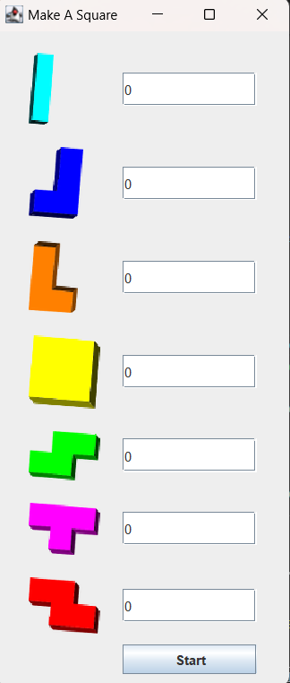
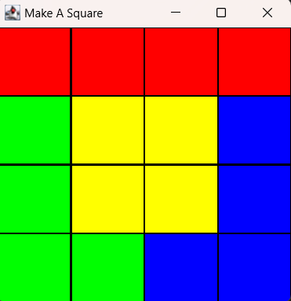

# Multi Threaded Tetris Puzzle Solver

# what is this?

Our program solves the Tetris puzzle using a multi-threaded approach. The program has a GUI that allows the user to select the pieces to solve the puzzle. The program then solves the puzzle and displays some of the steps and the solution in the GUI.

## Implementation

- The program is implemented in Java.
- The program uses a multi-threaded approach to solve the puzzle.

### Prerequisites

- Java JDK 8 or later
- Maven

### Prototype Images

- 
- 

### Examples

- I = 4
- O =4
- I =1 , J=1 , L=1 , O=1
- L=2, I=2
- L=2, O=2
- I=2, J=2
- L=2, Z=2
- S=2, J=2
- L=1, J=1, I=1, Z=1

### Authors

- [Mazin Islam](https://github.com/N1ghtHunter)
- [Kerolus Soliman](https://github.com/kerolus77)
- [Philo Ezzat](https://github.com/Philo-Ezzat)
- Fam Fayez
- [Kerolos Samy]()
- [Marina Ayman](https://github.com/MarinaAymanHanna)
- [Marina Ghattas](https://github.com/Marinaghatas)
